# WLC_Configuration
This is a basic Wireless LAN Controller setup done in Packet Tracer. Elements of the setup was taken from this [video](https://www.youtube.com/watch?v=0dfm9ws9DXI). However, most of it is done by myself.<br><br>

In this setup, a single WLC will be used to control 2 Lightweight APs. The 2 APs will provide for 2 different WLANs, Guest & Employee, with each AP providing for 1 WLAN. A server is used to provide DHCP service for the LWAPs.<br><br>

<b>Note: </b> This guide is based on the assumption that you have basic knowledge in networking and device configuration. Full CLI commands are not shown in this guide for the initial part, such as setting IP addresses. This guide will be more focused on WLAN and AP Group configuration through the WLC web interface.
# Configuration
## Design
### Lightweight AP Deployment
<br><br>
In this network, we will be using a wireless lightweight AP deployment (also known as split-MAC architecture). There will be a single Wireless LAN Controller (WLC) that is used to control all the lightweight APs (LWAPs) in the network. The LWAPs and WLC communicate with each other through a CAPWAP (Control and Provisioning of Wireless Access Points) tunnel.
<br>
<b>Picture by:Jeremy's IT Lab - CCNA Course (Youtube)</b><br>

## Topology
<br><br>
This topology consists of the following network devices:
- 1 Router: 4331
- 1 Switch: 3650 24PS
- 1 WLC: 3504
- 2 APs: LAP-PT
- 1 Server
- 3 End Devices: 1 Laptop & 2 Smartphones

### Reasons for choosing these network devices
<b><ins>4331 Router</ins></b><br>
There is no particular reason for the router selection as it was used solely as the default gateway of the network.<br><br>

<b><ins>3650 24PS Switch</ins></b><br>
The 3650 24PS switch was chosen as it has the following characteristics:
- Layer 3 switch: Became the default gateway for the VLAN, and would have a default route to the router (optional).
- Multiple Gigabit Ports: APs would benefit the most being connected to a gigabit connection and all the other routers in Packet Tracer only have at most 2 gigabit connection.
- Power over Ethernet (PoE): This allows the switch to power the APs without the APs needing to connect to an external power source.<br>

<b><ins>3504 WLC</ins></b><br>
The 3504/2504 WLC has more than 1 port which allow connections to more than 1 network device. This is unlike the WLC which only has 1 port.<br><br>

<b><ins>LAP-PT AP</ins></b><br>
Since a WLC is used in this topology, the APs should be lightweight access points. Thus the LAP-PT are used.<br><br>

<b><ins>Server</ins></b><br>
The server is used to provide DHCP service to the APs.<br><br>

<b><ins>End Devices</ins></b><br>
The laptop is used to configure the WLC and the 2 smartphones are used to connect to the APs and test the functionality.<br><br>

## Initial Setup
<b><ins>Step 1: Select the devices</b></ins><br>
- Select the correct network devices and place them into your workspace as shown in the picture above<br><br>

<b><ins>Step 2: Power on switch</b></ins><br>
- Once all the devices are placed into the workspace, the Switch needs to be powered on
- Click on SW1
- Then select the "AC-POWER-SUPPLY" module on the bottom right, hold and drag it into the physical switch empty space (right side of physical switch). There will be 2 empty spaces and you can place it in any one of them.<br>
  <br><br>

<b><ins>Step 3: Connect the devices together</b></ins><br>
- Once the power supply is connected to the Switch, wait for it to load up. You can view the CLI to check whether it is done loading.
- After loading, start connecting the devices using a straight-through cable since all the devices are connected to the switch.
- Make sure to keep track which ports are used for the connections<br><br>

<b><ins>Step 4: Power on LWAPs (Optional) </b></ins><br>
- This step is optional since the LWAPs will automatically receive power from SW1 through PoE.
- Enter the CLI of SW1 and key in the following commands:
```
SW1(config)# interface range g1/0/23-24
SW1(config-if-range)# power inline auto
```
- This will set the ports to automatically give power to PoE devices connected to it.
- Note: You should interface the ports that are connected to the APs in your configuration, may not be the same as mine.

<b><ins>Step 5: IPv4 Network Addressing</b></ins><br>
- The network between SW1 and R1 is 192.168.1.0/30.
  - R1: 192.168.1.1/30
  - SW1 G1/0/1: 192.168.1.2/30 
- The network of VLAN1 (all other devices connected to SW1) will be 192.168.0.0/24.
  - SW1 VLAN1: 192.168.0.254/24
  - SRV1: 192.168.0.1/24
  - WLC1: 192.168.0.2/24
- Set the default gateway of SRV1 and WLC1 as SW1 VLAN1 (192.168.0.254).<br><br>

<b><ins>Step 6: IP Routing</b></ins><br>
- R1
  - Set a route to the network 192.168.0.0/24 making SW1 G1/0/1 IPv4 address (192.168.1.2) the next hop
- SW1
  - Enable IP routing on SW1
  - Configure a default route to R1 G0/0/0 interface (192.168.1.1)
 
## Server DHCP Service Configuration
- Select the following: SRV1 > Services > DHCP
- Set the following: <br>
  - The DHCP pool should be within the subnet of VLAN 1, 192.168.0.0/24
  - Good practice to reserve the first few addresses of the network
  - The default gateway should be the IP address of SW1 VLAN 1, 192.168.0.254
  - The DNS server is not set since DNS is not used for this lab
  - Make sure to set the service as 'On'
  - Once done, save<br>
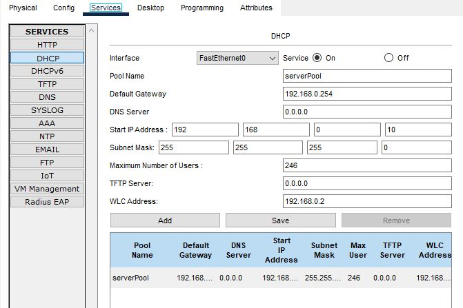<br><br>

## Testing DHCP and IP configurations
<b><ins>LWAPs</b></ins><br>
- Set the 'Gateway/DNS IPv4' to Static and then back to DHCP
- The Default Gateway and DNS Server should be the same as configured in the DHCP Pool
  - Default Gateway: 192.168.0.254
  - DNS: 0.0.0.0
- Hover over the device in the logical view and you should be able to view the IP address of the LWAP
- Make sure that it is within the range of the DHCP pool (192.168.0.10 - 192.168.0.254)<br><br>
  
<b><ins>Laptop</b></ins><br>
- Using the command prompt, check the currnet ipconfig
- Renew the ipconfig and make sure it follows the DHCP pool

## WLC Configuration
### Initial Setup
<b><ins>Step 1: Connect to WLC</b></ins><br>
- Go to Laptop > Desktop > Web Browser
- Key in IP address of WLC (192.168.0.2) in the URL
- The Admin creation page will come out as shown below:<br>
  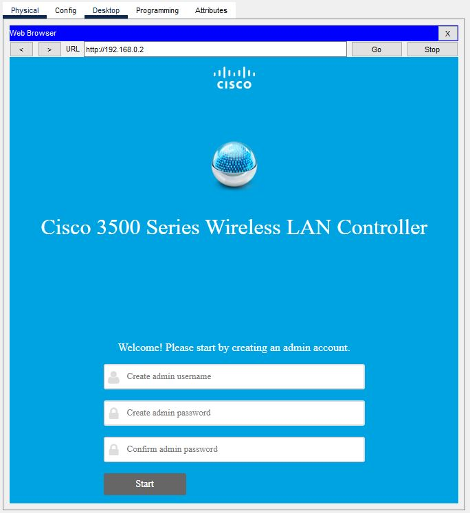<br><br>

<b><ins>Step 2: Admin Setup</b></ins><br>
- Set the admin username and password, it will be used to login into the WLC portal after setup
- Next, you will set the controller configurations
  - System Name: WLC1
  - Management IP: 192.168.0.2 (IP address of the WLC that was set earlier in 'Initial Setup' > Step 5.
  - Subnet Mask: 255.255.255.0
  - Default Gateway: 192.168.0.254 (IP address of SW1 VLAN 1)
- Next, create your wireless network (required to set up at least 1 network)
  - Select Employee
  - Network Name: Employee
  - Passphrase: <password>
- You don't need to do the last part, can just click 'Next'
- The following pictures are in the order just explained<br>
  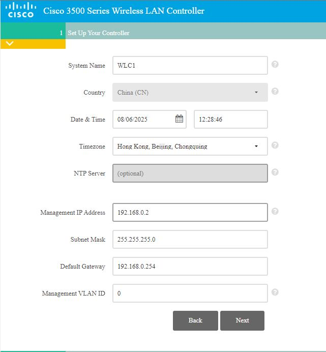<br><br>
  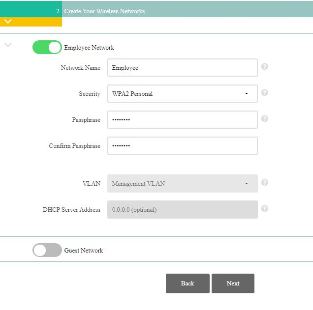<br><br>
  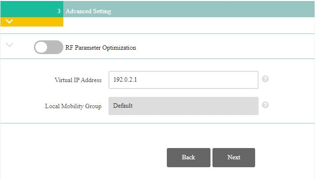<br><br>

<b><ins>Step 3: Reconnecting to WLC</b></ins><br>
- Once you have completed step 2, there will be a warning. Just click OK
- Close the window and enter Command Prompt.
- Ping WLC1
- Once you receive a response, it means that the set up is complete.
- Close the window and enter Web Browser
- Type in the URL "https://192.168.0.2" (IP address of WLC1)
- The following login page should appear<br>
  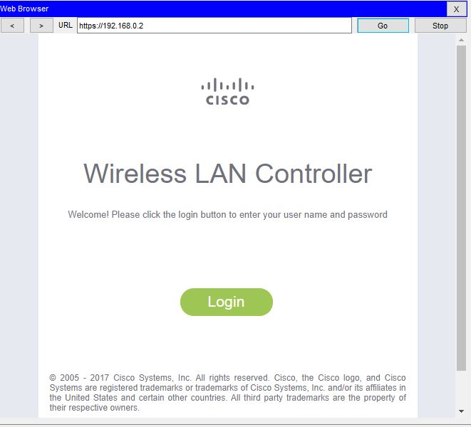<br><br>

## WLAN & AP Group Setup
<b><ins>Step 1: Login into WLC</b></ins><br>
- Login into the WLC using the username and password set in Step 2
- You should see the following page:<br>
  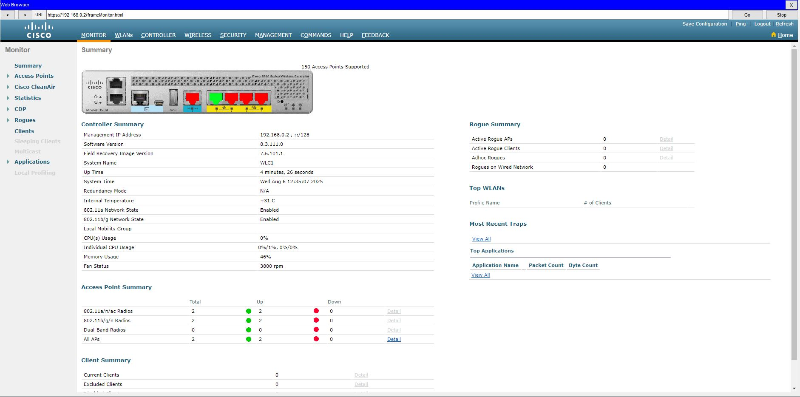<br><br>

<b><ins>Step 2: Setting Up WLANs</b></ins><br>
- From the Monitor page (Home page), select WLANs
- You should be able to view the WLAN that was created earlier in step 2, as shown below:<br>
  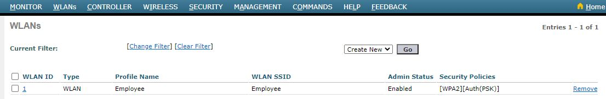<br><br>

- Click on 'Go" located beside the "Create New" dropdown.
- Set Profile Name and SSID to "Guest", then click "Next"<br>
  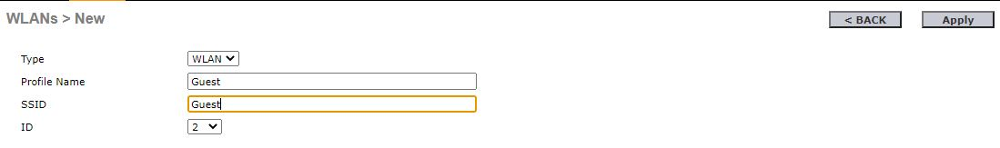<br><br>

- In the "General" settings, set "Status" to enabled<br>
  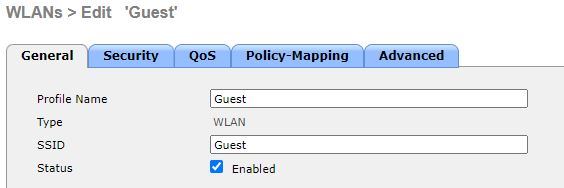<br><br>

- In the "Security" > "Layer 2" settings
  - Set "Layer 2 Security" to "WPA+WPA2"
  - Under "WPA+WPA2 Parameters", select "WPA2 Policy"
  - Next, under "Authentication Key Management", select "PSK"
  - Then, under "PSK Format", key in your password for the WLAN<br>
  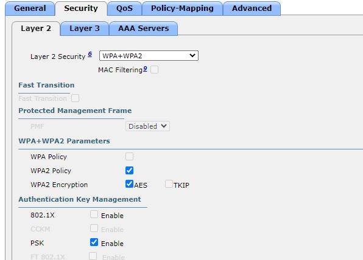<br><br>
  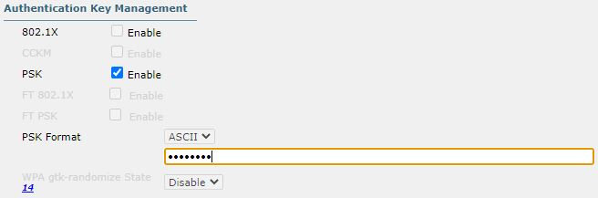<br><br>
  
- Once done, click "OK" and then click "Back". The new Guest WLAN should appear as shown below:<br>
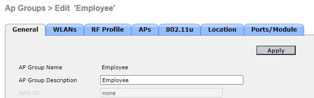<br><br>

<b><ins>Step 3: Setting Up AP Groups</b></ins><br>
Before setting up AP Groups, minimize the web browser and hover your mouse over the 2 LWAPs. You should be able to see that both LWAPs will have "CAPWAP Status: Connected to 192.168.0.2" and below it the "Providing WLANs" should consist of both Guest and Employee WLAN.<br>

- From the same page ("WLANs" page), click on "AP Groups", located on the left side of the page<br>
  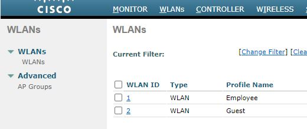<br><br>

- You will see "default-group". Currently, all APs are grouped in it<br>
  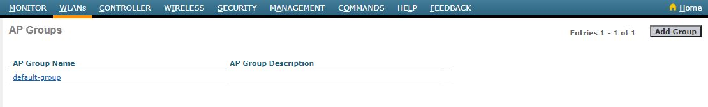<br><br>

- Select "Add Group" on the top left of the screen
- Then, set the following
  - AP Group Name: Employee
  - Description: Employee Wi-Fi (or whatever description you want)<br>
  - Click on <br>
    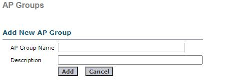<br><br>

- Now, click on "Employee" group
- Under "WLANs", select "Employee(1)" for the WLAN SSID<br>
  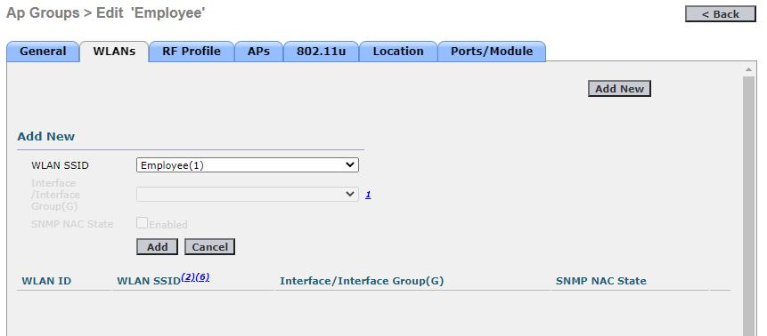<br><br>

- Under "APs", select LWAP1, the LWAP located within Employee in the topology<br>
  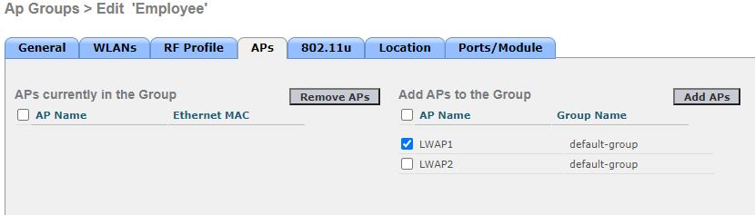<br><br>

<br>
- Make sure to save all the configurations by clicking on "Apply"

## Testing WLC Configuration
- Hover your mouse above the LWAPs, you should now see that under "Providing WLANs", it only contain the respective WLAN instead of both WLANs previously.
- Go to Smartphone > Config > Wireless
- Set the SSID to "Employee" and "Guest" respectively
- Under "Authentication", select "WPA2-PSK" and key in the password you previously set
- After a while, a connection will be established between the smartphone and the LWAP<br>
  <br><br>

- Also, notice that the IP address of the phone is within the range configured in DHCP pool earlier.<br>
  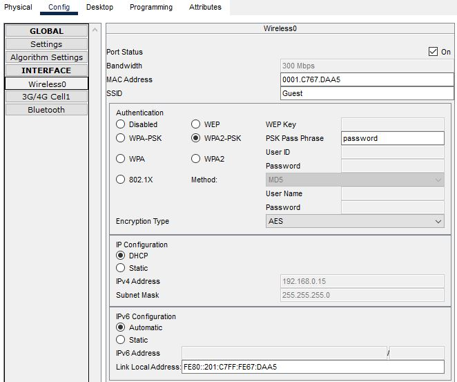<br><br>
  
<b>Note:</b> Due to limitations on Packet Tracer, only 1 smartphone will be connected to its respective . You can try to save and restart to see whether the other smartphone connects to its respective LWAP. I restarted mine and managed to get it to work for the other smartphone.<br>
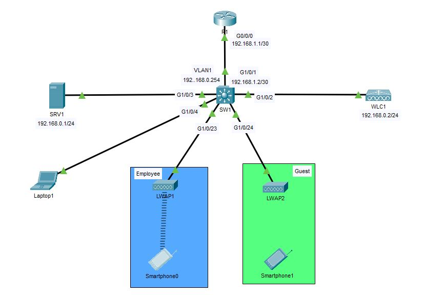<br><br>

# The End
That's all for the lab. Thanks for reading.
