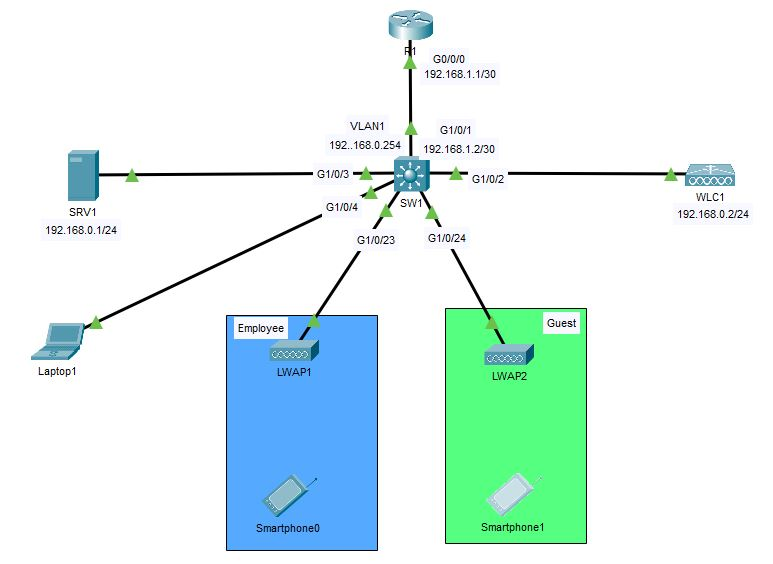
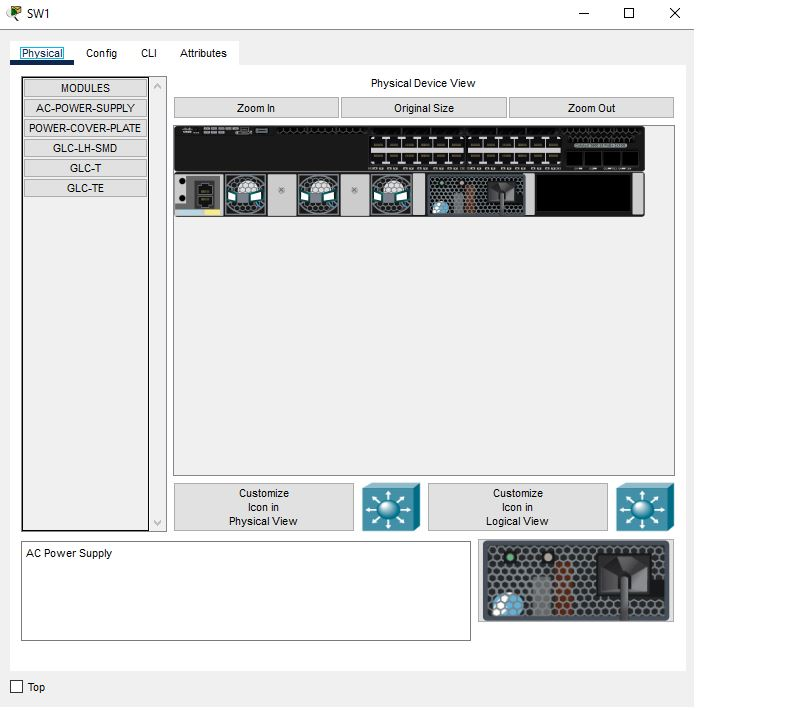

# WLC_Configuration
This is a basic Wireless LAN Controller setup done in Packet Tracer. Elements of the setup was taken from this [video](https://www.youtube.com/watch?v=0dfm9ws9DXI).  

In this setup, a single WLC will be used to control 2 Lightweight APs. The 2 APs will provide for 2 different WLANs, Guest & Employee, with each AP providing for 1 WLAN. A server is used to provide DHCP service for the LWAPs.

# Configuration
## Topology
  
This topology consists of the following network devices:
- 1 Router: 4331
- 1 Switch: 3650 24PS
- 1 WLC: 3504
- 2 APs: LAP-PT
- 1 Server
- 3 End Devices: 1 Laptop & 2 Smartphones

### Reasons for choosing these network devices
<b>1. 4331 Router</b> 
There is no particular reason for the router selection as it was used solely as the default gateway of the network.  

<b>2. 3650 24PS Switch</b> 
The 3650 24PS switch was chosen as it has the following characteristics:
- Layer 3 switch: Became the default gateway for the VLAN, and would have a default route to the router (optional).
- Multiple Gigabit Ports: APs would benefit the most being connected to a gigabit connection and all the other routers in Packet Tracer only have at most 2 gigabit connection.
- Power over Ethernet (PoE): This allows the switch to power the APs without the APs needing to connect to an external power source. 

<b>3. 3504 WLC</b> 
The 3504/2504 WLC has more than 1 port which allow connections to more than 1 network device. This is unlike the WLC which only has 1 port.  

<b>4. LAP-PT AP</b> 
Since a WLC is used in this topology, the APs should be lightweight access points. Thus the LAP-PT are used.  

<b>5. Server</b> 
The server is used to provide DHCP service to the APs.  

<b>6. End Devices</b> 
The laptop is used to configure the WLC and the 2 smartphones are used to connect to the APs and test the functionality.  

### Initial Setup
<b><u>Step 1</b></u> 
- Select the correct network devices and place them into your workspace  

<b><u>Step 2</b></u> 
- Once all the devices are placed into the workspace, the Switch needs to be powered on
- Click on SW1
- Then select the "AC-POWER-SUPPLY" module on the bottom left and place it into the physical switch empty space. There will be 2 empty spaces and you can place it in any one of them.
    
